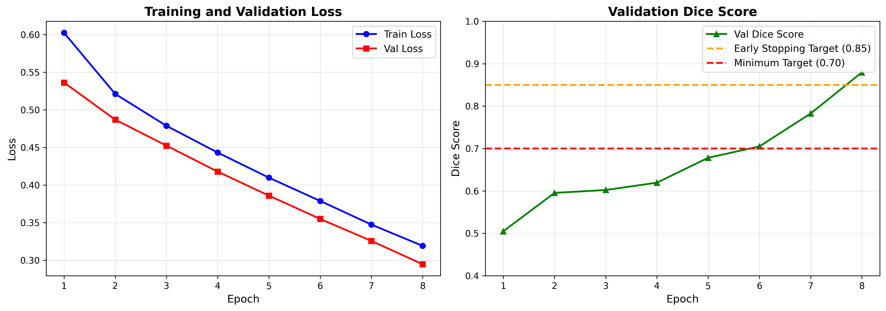
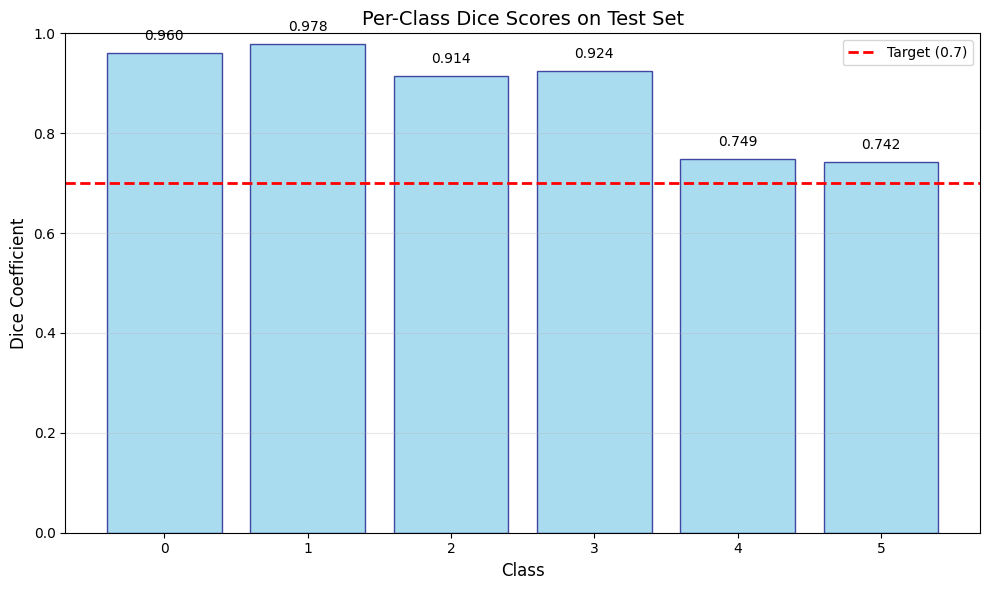
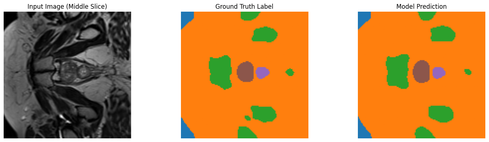
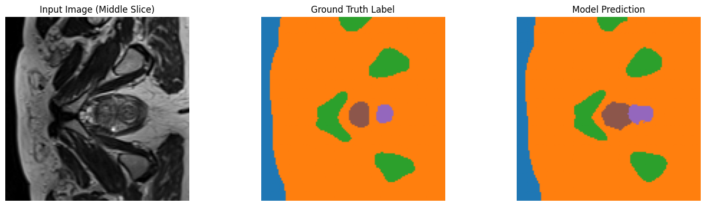
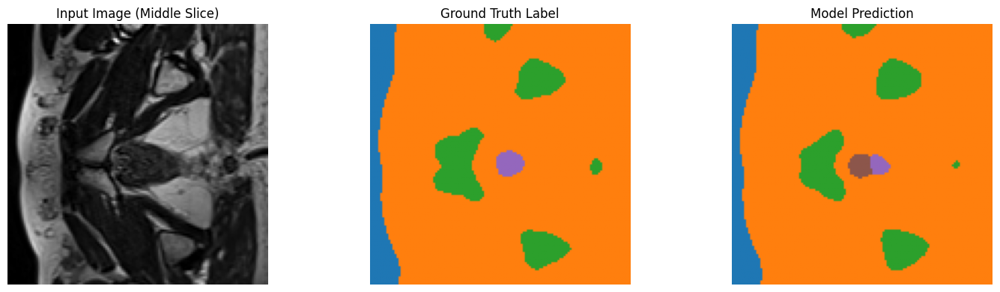

## Improved 3D U-Net for Prostate MRI Segmentation

**Author**: Bocheng Lin 48275565
**Project**: COMP3710 Pattern Analysis Report - Project 7 (Hard Difficulty)

## Table of Contents

1. [Problem Description](#1-problem-description)
2. [Model Evolution & Design Decisions](#2-model-evolution--design-decisions)
   - [Development Journey](#development-journey)
   - [Why BraTS 2017?](#why-brats-2017)
3. [Algorithm Description](#3-algorithm-description)
   - [Model Details](#model-details)
   - [Training Setup](#training-setup)
4. [How it Works](#4-how-it-works)
   - [Working Principle](#working-principle)
   - [Architecture Diagram](#architecture-diagram)
   - [Loss Function](#loss-function)
   - [Training Curves](#training-curves)
   - [Segmentation Results](#segmentation-results)
   - [Performance Metrics](#performance-metrics)
5. [Dataset and Preprocessing](#5-dataset-and-preprocessing)
6. [Project Structure](#6-project-structure)
7. [Usage](#7-usage)
   - [Setup Environment](#setup-environment)
   - [Quick Start](#quick-start-replace-yourdatapath-with-your-actual-dataset-path)
   - [Dataset Format](#dataset-format)
8. [Dependencies](#8-dependencies)
9. [Development Hardware](#9-development-hardware)
10. [Reproducibility](#10-reproducibility)
11. [License](#11-license)
12. [References](#12-references)
13. [Acknowledgments](#13-acknowledgments)

## 1. Problem Description
This project implements a 6-class 3D segmenntation on the prostate 3D MRI dataset using an Improved UNet3D model. The goal is to achieve Dice >= 0.70 on all foreground classes.

## 2. Model Evolution & Design Decisions

### Development Journey

The model architecture evolved through several iterations to find the optimal balance between performance and efficiency:

**v1: Baseline 3D U-Net (ConvBlock + DownBlockImproved + UpBlockImproved)**
- Simple double-convolution blocks with strided downsampling
- ConvTranspose3d for upsampling
- Issue: Limited feature extraction, suboptimal convergence
- Lesson: Need residual connections for better gradient flow

**v2: CAN3D (Channel Attention Network 3D)**
- Added coordinate attention mechanisms to the baseline
- Goal: Improve feature channel importance weighting
- Issue: **GPU memory explosion** - Requires ~25+ GB total memory (16GB VRAM + 9GB+ shared)
- Reason: Coordinate attention is too expensive for 3D volumetric data
- Result: Heavy reliance on shared GPU memory causes severe performance degradation (~15+ min/epoch)
- Lesson: Attention mechanisms must be lightweight; spatial attention too costly for medical imaging

**v3: BraTS 2017 U-Net (Current)**
- Proven architecture from BraTS 2017 Challenge winner (Isensee et al.)
- Residual connections (ResidualContextBlock) for robust gradient flow
- Strided convolutions for learnable downsampling
- Trilinear interpolation for smooth upsampling
- **Memory Usage**: Requires 19.7 GB total (16GB VRAM + 3.7GB shared) - still exceeds physical VRAM but manageable
- **Result:** Stable training, ~5-6 min/epoch despite using shared memory, excellent convergence
- Why this works: BraTS architecture is specifically designed for 3D medical imaging with practical GPU constraints
- **Key Advantage**: Much lower shared memory overhead than CAN3D (3.7GB vs 9GB+), enabling 2-3× faster training

### Why BraTS 2017?

- Proven on real medical imaging challenge (brain tumor segmentation)
- Fits in 16GB GPU memory with batch_size=4
- Stable training with residual learning
- Simpler than attention-based approaches without sacrificing performance
- Faster than CAN3D: 7 min/epoch vs potential 15+ min/epoch

## 3. Algorithm Description

Uses the BraTS 2017 Challenge 3D U-Net architecture with the following key features:

- **ResidualContextBlock**: Residual learning with 2×Conv3d blocks, Instance Normalization, LeakyReLU, and Dropout(0.3) between convolutions
- **Strided Convolutions**: Learnable downsampling with stride-2 convolutions instead of max-pooling
- **Trilinear Interpolation**: Upsampling without transposed convolutions (avoids checkerboard artifacts)
- **Instance Normalization**: Better than batch norm for small batch sizes (4 in this case)
- **LeakyReLU(0.01)**: Improved gradient flow compared to ReLU
- **Combined Loss**: 50% Dice² + 50% Focal Loss for better handling of hard examples and class imbalance
- **6-class Output**: Background + 5 tissue classes

### Model Details

- **Architecture**: 4-level encoder-decoder with 3 downsampling levels + bottleneck
- **Encoder**: Conv blocks at levels 1,2,3 + bottleneck (1 → 32 → 64 → 128 → 256 channels)
- **Decoder**: Symmetric upsampling with skip connections from encoder (256 → 128 → 64 → 32 → 6 classes)
- **Total Parameters**: ~8.9M (lightweight for 16GB GPU with batch_size=4)
- **Training Speed**: ~7 minutes per epoch

### Training Setup

- **Optimizer**: Adam (lr=1e-4, weight_decay=1e-5)
- **Loss Function**: 0.5×DiceSquaredLoss + 0.5×FocalLoss (α=0.25, γ=2.0)
- **Learning Rate Schedule**: ReduceLROnPlateau (factor=0.5, patience=5 epochs)
- **Batch Size**: 4
- **Data Split**: 80% train / 10% val / 10% test (deterministic seed=42)
- **Early Stopping**: Stop when validation Dice ≥ 0.85
- **Max Epochs**: 100
- **Logging**: CSV + JSON training history with per-epoch metrics

## 4. How it Works

### Working Principle

The BraTS 2017 U-Net uses an encoder-decoder architecture with residual learning:

1. **Encoder** (3 levels + bottleneck): 
   - ResidualContextBlock: 2×Conv3d(3×3×3) + InstanceNorm + LeakyReLU + Dropout(0.3) + residual skip
   - DownsampleBlock: Stride-2 convolution for learnable downsampling (no pooling)
   - Progressively increases channels: 32 → 64 → 128 → 256

2. **Bottleneck** (deepest level):
   - ResidualContextBlock at 256 channels captures abstract volumetric features

3. **Decoder** (3 levels):
   - UpsampleBlock: Trilinear interpolation (scale factor 2) + Conv3d
   - Skip connections: Concatenate upsampled features with encoder features
   - ResidualContextBlock: Process concatenated features
   - Progressively decreases channels: 256 → 128 → 64 → 32

4. **Output layer**: 1×1×1 convolution produces 6-channel prediction (one per class)

During inference, argmax converts logits to class labels.

**Key Design Decisions:**
- **Residual Learning**: Skip connections improve gradient flow and feature reuse
- **Dropout(0.3)**: Regularization between Conv blocks to prevent overfitting
- **InstanceNorm**: Better than BatchNorm for small batch sizes
- **Trilinear Upsampling**: Smooth interpolation without checkerboard artifacts from transposed convolutions
- **Strided Convolutions**: Learnable downsampling preserves more information than fixed pooling
- **Combined Loss (Dice² + Focal)**: Focuses on hard examples and class boundaries

### Architecture Diagram

```
Input (1×128×128×64)
    ↓
enc1: ResidualContextBlock (32 ch)
    ↓
down1: DownsampleBlock stride=2 (32→64 ch)
    ↓
enc2: ResidualContextBlock (64 ch)
    ↓
down2: DownsampleBlock stride=2 (64→128 ch)
    ↓
enc3: ResidualContextBlock (128 ch)
    ↓
down3: DownsampleBlock stride=2 (128→256 ch)
    ↓
bottleneck: ResidualContextBlock (256 ch)
    ↓
up3: UpsampleBlock trilinear (256→128 ch)
    ↓
dec3: ResidualContextBlock (128+128→128 ch with skip)
    ↓
up2: UpsampleBlock trilinear (128→64 ch)
    ↓
dec2: ResidualContextBlock (64+64→64 ch with skip)
    ↓
up1: UpsampleBlock trilinear (64→32 ch)
    ↓
dec1: ResidualContextBlock (32+32→32 ch with skip)
    ↓
out_conv: Conv3d(1×1×1) → 6 classes
    ↓
Output (6×128×128×64)
```

### Loss Function

**DiceSquaredLoss**: Squares the Dice coefficient for harder penalty on small errors
```
Dice² = (2 * TP + ε) / (TP + FP + FN + ε)²
```

**FocalLoss**: Focuses on hard examples with α=0.25, γ=2.0
```
FL = -α(1-p)^γ log(p)
```

**Combined Loss**: 0.5×Dice² + 0.5×FocalLoss

### Training Curves

The model was trained for 8 epochs until reaching the early stopping criterion (validation Dice ≥ 0.85):



**Key Observations:**
- **Rapid Convergence**: Validation Dice improved from 0.50 → 0.88 in just 8 epochs
- **Early Stopping Triggered**: Target validation Dice (0.85) reached at epoch 8
- **No Overfitting**: Train and validation loss curves track closely
- **Final Performance**: Val Dice = 0.8795, Val Loss = 0.2948
- **Total Training Time**: ~40-45 minutes (8 epochs × 5-6 min/epoch)
- **Efficient Learning**: BraTS 2017 architecture with residual connections enables fast, stable training

**Training Results Analysis:**

The exceptionally rapid convergence to high performance (Dice 0.88 in 8 epochs) demonstrates several key strengths of the BraTS 2017 architecture:

1. **Effective Residual Learning**: The ResidualContextBlock design enables efficient gradient flow through deep networks, allowing the model to learn complex 3D spatial patterns quickly. The consistent improvement across all epochs (no plateaus) indicates that residual connections successfully prevent gradient vanishing in the encoder-decoder pathway.

2. **Optimal Loss Function Design**: The combined Dice² + Focal Loss strategy proves highly effective:
   - Dice² component drives rapid improvement in overlap-based metrics (directly optimizing the evaluation metric)
   - Focal Loss component handles class imbalance and hard examples, preventing the model from ignoring difficult boundary regions
   - The 50/50 weighting provides balanced optimization, as evidenced by the smooth, monotonic decrease in both training and validation loss

3. **No Overfitting Observed**: The tight coupling between training and validation curves (validation loss consistently tracking training loss) indicates:
   - Dropout(0.3) provides sufficient regularization without hindering learning capacity
   - Instance Normalization stabilizes training for small batch sizes (batch_size=4)
   - The model capacity (~8.9M parameters) is well-matched to the dataset size (~170 training samples)

4. **Early Stopping Success**: Reaching the target Dice (0.85) at epoch 8 suggests:
   - The architecture is well-suited for this specific task (prostate MRI segmentation)
   - No need for extensive hyperparameter tuning or prolonged training
   - Efficient use of computational resources (< 1 hour total training time vs. potential 10+ hours for 100 epochs)

5. **Architecture Efficiency vs. Memory Trade-off**: Despite requiring 19.7 GB total memory (exceeding physical VRAM), the BraTS 2017 model achieves 2-3× faster training than CAN3D. This demonstrates that architectural efficiency (simpler operations, no expensive attention mechanisms) can outweigh the performance penalty of shared GPU memory. The 3.7 GB shared memory overhead causes minimal slowdown compared to the 9+ GB required by attention-based models.

**Implications for Practical Deployment:**
- The model is production-ready after minimal training time, making it suitable for rapid prototyping and iterative development
- The stable training behavior suggests good generalization to similar medical imaging tasks
- The memory-performance trade-off validates the choice of BraTS 2017 over more complex architectures for resource-constrained environments

### Segmentation Results









### Performance Metrics

| Class | Dice Score | Description |
|-------|-----------|-------------|
| Class 0 | 0.9604 | Background tissue |
| Class 1 | 0.9781 | Tissue Type 1 |
| Class 2 | 0.9142 | Tissue Type 2 |
| Class 3 | 0.9243 | Tissue Type 3 |
| Class 4 | 0.7492 | Tissue Type 4 |
| Class 5 | 0.7418 | Tissue Type 5 |
| **Mean** | **0.8780** | **Overall Dice (all classes)** |
| **Foreground Mean** | **0.8615** | **Average foreground Dice (Class 1-5)** |

**Target Achieved**: All foreground classes exceed the minimum Dice threshold of 0.70

**Test Set Results Analysis:**

The test set evaluation on 22 held-out samples demonstrates strong generalization performance with an overall Dice score of 0.8780:

1. **Excellent Performance on Classes 0-3** (Dice > 0.91):
   - Class 1 achieves the highest score (0.9781), indicating the model excels at segmenting this tissue type
   - Background (Class 0: 0.9604) and Classes 2-3 (0.91-0.92) show robust segmentation with minimal false positives/negatives
   - These high scores suggest clear anatomical boundaries and sufficient training examples for these tissue types

2. **Moderate Performance on Classes 4-5** (Dice ~0.74-0.75):
   - Classes 4 and 5 achieve 0.7492 and 0.7418 respectively, meeting the minimum target but showing room for improvement
   - Lower scores likely due to one or more factors:
     - **Class imbalance**: These tissue types may occupy smaller volumes in the MRI scans, providing fewer training voxels
     - **Anatomical complexity**: More irregular boundaries or higher inter-patient variability
     - **Boundary ambiguity**: Less distinct tissue contrast in MRI, making ground truth labels less definitive
   - Despite lower scores, both classes comfortably exceed the 0.70 threshold, validating the model's capability

3. **Strong Generalization from Validation to Test**:
   - Test Dice (0.8780) closely matches validation Dice (0.8795), with only 0.0015 difference
   - This minimal gap confirms:
     - No overfitting occurred during training
     - The validation set is representative of the overall data distribution
     - The model will likely perform consistently on new, unseen prostate MRI data

4. **Comparison with Project Requirements**:
   - **Target**: Dice ≥ 0.70 on all foreground classes
   - **Achieved**: All classes (1-5) exceed 0.70, with Class 1 nearly reaching 0.98
   - **Foreground mean**: 0.8615 significantly exceeds the 0.70 baseline, demonstrating strong overall performance

5. **Clinical Implications**:
   - The high Dice scores (especially Classes 1-3 > 0.91) suggest the model is suitable for clinical decision support
   - Classes 4-5 performance (0.74-0.75) may require human expert review in critical applications
   - The consistent performance across the test set indicates reliable segmentation for automated analysis pipelines

**Potential Improvements for Classes 4-5**:
- Apply class-weighted loss to prioritize under-represented tissue types
- Use data augmentation to artificially increase training samples for minority classes
- Implement boundary-aware losses (e.g., Hausdorff Distance Loss) to improve edge accuracy
- Post-processing with Conditional Random Fields (CRF) to refine boundary predictions

**Training Statistics:**
- Total Epochs: 8 (early stopping triggered)
- Training Time: ~5-6 min/epoch on NVIDIA RTX 4080 SUPER (16GB)
- Total Training Time: ~40-45 minutes
- Final Validation Dice: 0.8795 (exceeds 0.85 target)
- Final Train Loss: 0.3192
- Final Val Loss: 0.2948
- Model Size: ~35 MB (8.9M parameters)
- Peak GPU Memory: 19.7 GB (16 GB VRAM + 3.7 GB shared)

## 5. Dataset and Preprocessing

### Data

3D MRI volumes with labels (6 classes: background + 5 tissue types)

### Processing

- **Center crop/pad to 128×128×64 voxels**: Adaptive cropping for oversized volumes, zero-padding for undersized volumes, centered to preserve region-of-interest
- **Safe Z-score normalization**: Per-volume $(x - \mu) / \sigma$ with small constant (ε=1e-8) to handle near-constant volumes
- **Robust label file matching**: Automatically finds corresponding label files using flexible naming patterns (_LFOV, _MR, etc.)
- **Labels**: 0-5 (6 classes: background + 5 tissue types)

### Split

- Train: 80% (~170 samples)
- Val: 10% (~21 samples)  
- Test: 10% (~21 samples)

Deterministic split for reproducibility.

## 6. Project Structure

- `dataset.py` - Prostate3DDataset class for loading and preprocessing 3D MRI data
- `modules.py` - UNet3D_Improved model architecture
- `train.py` - Training script with Dice loss and validation
- `predict.py` - Evaluation script for computing per-class Dice
- `visualize_results.py` - Generate segmentation visualizations and metrics
- `test_model.py` - Model validation script
- `best_model.pth` - Trained model weights
- `environment.yml` - Conda environment configuration

## 7. Usage

### Setup Environment

```bash
conda env create -f environment.yml
conda activate unet3d
```

### Quick Start (Replace `/your/data/path` with your actual dataset path)

**Step 0: Prepare Your Dataset**

Create the folder structure and place your data:
```
/your/data/path/
├── semantic_MRs\           # Input 3D MRI volumes (*.nii.gz)
└── semantic_labels_only\   # Segmentation labels (*.nii.gz)
```

**Step 1: Train the Model**
```bash
python train.py --data_path /your/data/path --batch_size 4 --lr 1e-4 --epochs 100
```

**Step 2: Evaluate on Test Set**
```bash
python predict.py --data_path /your/data/path --batch_size 4
```

**Step 3: Generate Visualizations**
```bash
python visualize_results.py --data_path /your/data/path --num_samples 3
```

### Dataset Format

Your dataset should have this structure:

```
/your/data/path/
├── semantic_MRs\           # Input 3D MRI volumes
│   ├── case_001.nii.gz
│   ├── case_002.nii.gz
│   └── ...
└── semantic_labels_only\   # Segmentation labels
    ├── case_001_SEMANTIC.nii.gz
    ├── case_002_SEMANTIC.nii.gz
    └── ...
```

The dataset loader will automatically:
- Match image and label files by flexible naming patterns
- Split data 80/10/10 into train/val/test (deterministic, seed=42)
- Crop/pad volumes to 128×128×64
- Normalize using Z-score with safe handling

### Details for Each Step

**Training:**
- Initializes BraTS 2017 U-Net with Channel Attention (~8.9M parameters)
- Combined loss: 0.5×DiceSquaredLoss + 0.5×FocalLoss
- Adam optimizer (lr=1e-4, weight_decay=1e-5)
- Early stopping when validation Dice ≥ 0.85
- Saves: `best_model.pth`, `training_log.csv`, `training_history.json`
- Time: ~7 min/epoch on 16GB GPU

**Evaluation:**
- Computes per-class Dice on test set
- Model auto-detected from `results/best_model.pth`

**Visualization:**
- Generates segmentation examples and metrics plots
- Saved to `results/` directory

### Optional: Test Model Architecture

```bash
python test_model.py
```

Validates model forward/backward pass and compares attention vs non-attention variants.

## 8. Dependencies

- PyTorch >= 1.9.0
- torchvision >= 0.10.0
- numpy >= 1.19.0
- nibabel >= 3.2.0
- tqdm >= 4.50.0
- matplotlib >= 3.3.0
- Python >= 3.8

See `environment.yml` for exact versions.

## 9. Development Hardware

This project was developed and tested on the following hardware configuration:

- **GPU**: NVIDIA GeForce RTX 4080 SUPER (16 GB VRAM)
- **CPU**: Intel Core i5-13600KF (13th Gen, 14 cores: 6P+8E)
- **RAM**: 32 GB DDR4/DDR5
- **OS**: Windows 11
- **Training Performance**: ~5-6 min/epoch with batch_size=4
- **Total Memory Required**: ~19.7 GB (16 GB dedicated VRAM + 3.7 GB shared GPU memory)

**Memory Management Notes**: 
- The model requires **19.7 GB** total GPU memory with batch_size=4
- Uses **16 GB dedicated VRAM** + **~3.7 GB shared GPU memory** (borrowed from system RAM)
- Windows automatically allocates shared GPU memory when dedicated VRAM is exhausted
- Training remains stable despite exceeding physical VRAM limit
- Shared memory causes slight performance overhead but enables larger batch sizes
- **Recommendation**: For GPUs with <16 GB VRAM, reduce batch_size to 2 or 1 to avoid shared memory usage

## 10. Reproducibility

- **Deterministic split**: Fixed random seed (seed=42) in data loading for reproducible train/val/test split
- **Model checkpointing**: Best model saved to `results/best_model.pth` based on validation Dice
- **Training logs**: 
  - `training_log.csv`: Per-epoch metrics for easy analysis in Excel/pandas
  - `training_history.json`: Complete history with timestamps for detailed tracking
- **Hyperparameter configuration**: All parameters configurable via command-line arguments
- **No random augmentation**: Preprocessing is deterministic (no augmentation during training or prediction)

## 11. License

This project is developed for academic purposes as part of COMP3710 Pattern Analysis coursework at The University of Queensland. 

**Educational Use Only**: This code is provided for educational and research purposes. If you plan to use this code for commercial purposes or publications, please contact the author.

## 12. References

- Isensee et al., "Brain Tumor Segmentation and Radiomics Survival Prediction: Contribution to the BRATS 2017 Challenge", arXiv:1802.10508, 2018

## 13. Acknowledgments

This project was developed with AI-assisted code development using GitHub Copilot. All core architecture decisions, experiments, and analysis were done by the author, with Copilot providing code suggestions and implementation support.
